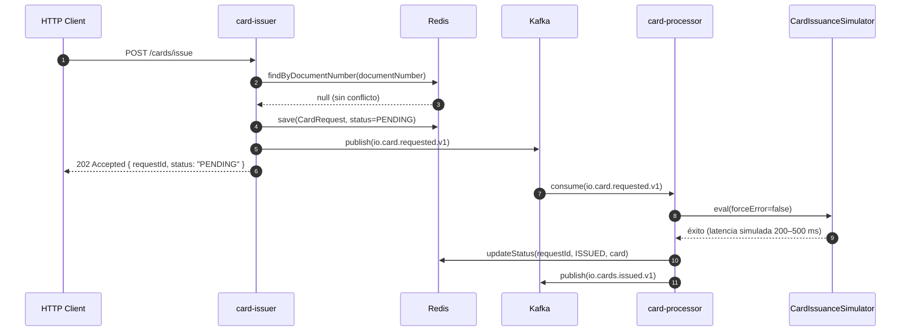
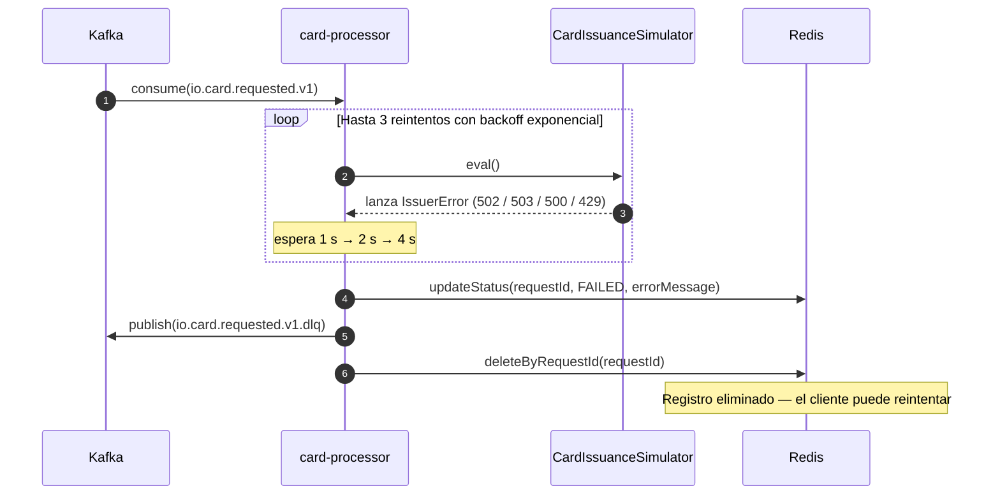
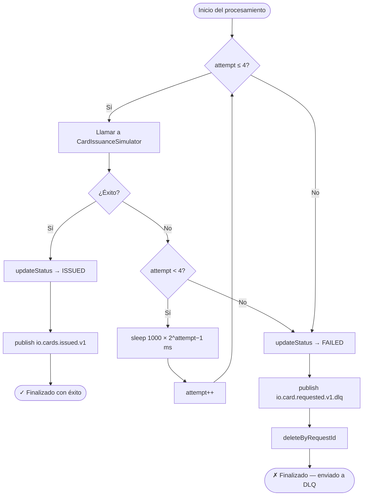
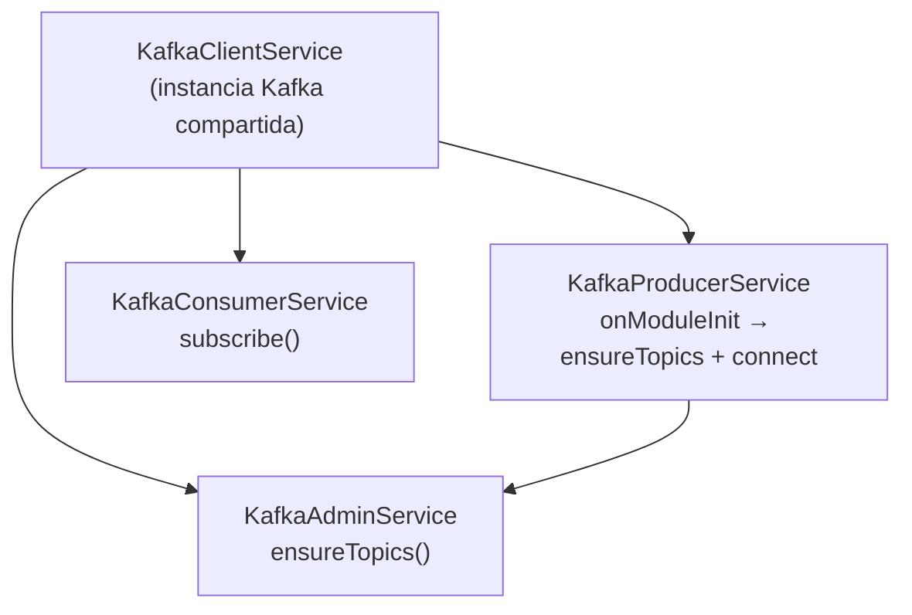
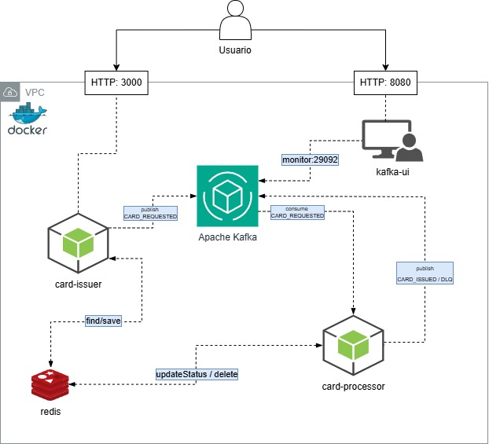

# io-backend-test

Sistema desarrollado como parte de un reto técnico para Yape, construido con NestJS, Apache Kafka y Redis. La arquitectura sigue un enfoque de microservicios con diseño hexagonal, separando la ingesta de solicitudes con procesamiento asíncrono y con énfasis en escalabilidad, resiliencia y desacoplamiento entre componentes.

---

## Tabla de contenidos

- [io-backend-test](#io-backend-test)
  - [Tabla de contenidos](#tabla-de-contenidos)
  - [Descripción general](#descripción-general)
  - [Cómo ejecutar el proyecto](#cómo-ejecutar-el-proyecto)
    - [Requisitos previos](#requisitos-previos)
    - [Ejecutar con Docker (recomendado)](#ejecutar-con-docker-recomendado)
    - [Ejecutar localmente (desarrollo)](#ejecutar-localmente-desarrollo)
    - [Build para producción](#build-para-producción)
  - [Referencia de la API](#referencia-de-la-api)
    - [`POST /cards/issue`](#post-cardsissue)
      - [Cuerpo de la solicitud](#cuerpo-de-la-solicitud)
      - [Respuestas](#respuestas)
      - [Ejemplo con curl](#ejemplo-con-curl)
      - [Forzar el flujo de DLQ](#forzar-el-flujo-de-dlq)
    - [Flujo exitoso — Emisión de tarjeta correcta](#flujo-exitoso--emisión-de-tarjeta-correcta)
    - [Flujo de falla — Reintentos y Dead Letter Queue](#flujo-de-falla--reintentos-y-dead-letter-queue)
    - [Política de reintentos](#política-de-reintentos)
  - [Servicios](#servicios)
    - [card-issuer](#card-issuer)
      - [Estrategia de claves en Redis](#estrategia-de-claves-en-redis)
    - [card-processor](#card-processor)
      - [Errores simulados del emisor externo](#errores-simulados-del-emisor-externo)
  - [Librerías compartidas](#librerías-compartidas)
    - [`@contracts`](#contracts)
    - [`@kafka`](#kafka)
    - [`@logger`](#logger)
    - [`@common`](#common)
  - [Kafka Topics y contratos de eventos](#kafka-topics-y-contratos-de-eventos)
    - [Topics](#topics)
    - [Schemas de eventos](#schemas-de-eventos)
  - [Infraestructura Docker](#infraestructura-docker)
    - [Red de contenedores](#red-de-contenedores)
    - [Orden de arranque](#orden-de-arranque)
    - [Volúmenes](#volúmenes)
  - [Variables de entorno](#variables-de-entorno)
  - [Stack tecnológico](#stack-tecnológico)

---

## Descripción general

El sistema recibe solicitudes de emisión de tarjetas a través de REST, las persiste en Redis y emite eventos hacia Kafka. Un servicio separado consume esos eventos, simula la interacción con un emisor externo de tarjetas (60% de tasa de éxito), aplica una política de reintentos con backoff exponencial y publica el resultado — ya sea un evento de éxito o un evento de dead letter.

---

## Cómo ejecutar el proyecto

### Requisitos previos

- [Docker](https://www.docker.com/) 24+
- [Docker Compose](https://docs.docker.com/compose/) v2+
- Node.js 22+ _(solo para desarrollo local)_

### Ejecutar con Docker (recomendado)

```bash
# Construir imágenes e iniciar todos los servicios
docker compose up --build

# Modo detached (background)
docker compose up --build -d

# Ver logs de todos los servicios
docker compose logs -f

# Ver logs de un servicio específico
docker compose logs -f card-issuer
docker compose logs -f card-processor

# Detener y eliminar contenedores
docker compose down

# Detener, eliminar contenedores y volúmenes
docker compose down -v
```

> Tras modificar el código fuente, ejecutar `docker compose up --build` para forzar la reconstrucción de las imágenes.
> `docker compose down` solo elimina contenedores, no las imágenes. Para limpiarlas también, usar `docker compose down --rmi local`.

### Ejecutar localmente (desarrollo)

```bash
# 1. Instalar dependencias
npm install

# 2. Levantar solo la infraestructura
docker compose up kafka redis -d

# 3. Ejecutar los servicios con hot reload (terminales separadas)
npm run start:issuer:dev
npm run start:processor:dev
```

### Build para producción

```bash
npm run build:issuer
npm run build:processor

node dist/apps/card-issuer/main.js
node dist/apps/card-processor/main.js
```

---

## Referencia de la API

### `POST /cards/issue`

Envía una solicitud de emisión de tarjeta. Responde con `202 Accepted` de forma inmediata; el procesamiento ocurre de manera asíncrona a través de Kafka.

#### Cuerpo de la solicitud

```json
{
  "customer": {
    "documentType": "DNI",
    "documentNumber": "12345678",
    "fullName": "Jane Doe",
    "age": 30,
    "email": "jane.doe@example.com"
  },
  "product": {
    "type": "VISA",
    "currency": "PEN"
  },
  "forceError": false
}
```

| Campo | Tipo | Restricciones |
| --- | --- | --- |
| `customer.documentType` | `"DNI"` | Valor literal |
| `customer.documentNumber` | `string` | Exactamente 8 dígitos |
| `customer.fullName` | `string` | Mínimo 2 caracteres |
| `customer.age` | `number` | Entre 18 y 120 |
| `customer.email` | `string` | Formato de email válido |
| `product.type` | `"VISA"` | Valor literal |
| `product.currency` | `"PEN" \| "USD"` | |
| `forceError` | `boolean` | Default `false`. En `true` fuerza el flujo de DLQ. |

#### Respuestas

| Status | Escenario | Cuerpo |
| --- | --- | --- |
| `202` | Solicitud aceptada | `{ requestId, status: "PENDING" }` |
| `409` | El número de documento ya tiene una solicitud activa | `{ message: "Customer ... already has a card request" }` |
| `400` | Error de validación | `{ message: "Validation failed", errors: [...] }` |

#### Ejemplo con curl

```bash
curl -X POST http://localhost:3000/cards/issue \
  -H "Content-Type: application/json" \
  -d '{
    "customer": {
      "documentType": "DNI",
      "documentNumber": "12345678",
      "fullName": "Jane Doe",
      "age": 30,
      "email": "jane.doe@example.com"
    },
    "product": { "type": "VISA", "currency": "PEN" },
    "forceError": false
  }'
```

#### Forzar el flujo de DLQ

```bash
# forceError: true hace que todos los intentos del simulador fallen
# dispara el ciclo completo de reintentos → publica en DLQ → elimina registro de Redis
curl -X POST http://localhost:3000/cards/issue \
  -H "Content-Type: application/json" \
  -d '{
    "customer": {
      "documentType": "DNI",
      "documentNumber": "99999999",
      "fullName": "Test User",
      "age": 25,
      "email": "test@example.com"
    },
    "product": { "type": "VISA", "currency": "USD" },
    "forceError": true
  }'
```

---

### Flujo exitoso — Emisión de tarjeta correcta



---

### Flujo de falla — Reintentos y Dead Letter Queue



---

### Política de reintentos



| Intento | Espera antes del siguiente intento |
| --- | --- |
| 1 | 1 000 ms |
| 2 | 2 000 ms |
| 3 | 4 000 ms |
| 4 | — (final, envía a DLQ) |

---

## Servicios

### card-issuer

API REST responsable de recibir y registrar las solicitudes de emisión de tarjetas.

| Aspecto | Implementación |
| --- | --- |
| Transporte | HTTP vía NestJS + Express |
| Puerto | `3000` |
| Validación | Schema Zod a través de `ZodValidationPipe` |
| Control de duplicados | Búsqueda por `findByDocumentNumber` en Redis antes de guardar |
| Persistencia | Redis — dos claves por solicitud (ver tabla abajo) |
| Mensajería | Publica `CloudEvent<CardRequestedData>` en `io.card.requested.v1` |
| Observabilidad | `LoggingInterceptor` global registra cada request y response con su duración |

#### Estrategia de claves en Redis

| Clave | Valor | TTL |
| --- | --- | --- |
| `card:request:{requestId}` | `CardRequestEntity` serializado en JSON | 24 h |
| `card:doc:{documentNumber}` | `requestId` (índice de búsqueda) | 24 h |

---

### card-processor

Consumer de Kafka responsable de procesar las solicitudes de emisión de tarjetas de forma asíncrona.

| Aspecto | Implementación |
| --- | --- |
| Transporte | Consumer Kafka (sin servidor HTTP) |
| Disparador | Topic `io.card.requested.v1`, grupo `card-processor-group` |
| Simulación | `CardIssuanceSimulator` — 60% de tasa de éxito, latencia simulada de 200–500 ms |
| Política de reintentos | Máx. 3 reintentos, backoff exponencial `1000 × 2^(n−1)` ms |
| En caso de éxito | Actualiza Redis a `ISSUED`, publica `io.cards.issued.v1` |
| En caso de falla | Actualiza Redis a `FAILED`, publica en DLQ y **elimina el registro de Redis** para que el cliente pueda reintentar |

#### Errores simulados del emisor externo

| HTTP Status | Escenario simulado |
| --- | --- |
| `502` | Timeout del gateway del emisor |
| `503` | Emisor de tarjetas temporalmente no disponible |
| `500` | Error interno de procesamiento del emisor |
| `429` | Límite de tasa del emisor excedido |

---

## Librerías compartidas

### `@contracts`

Tipos compartidos, schemas de validación Zod e interfaces de datos de eventos utilizados por ambos servicios.

```typescript
// Envelope CloudEvent
interface CloudEvent<T> {
  id: number;
  source: string;         // requestId
  type: string;           // nombre del topic Kafka
  data: T;
  errors?: ErrorDetails[];
}

// Tipos del dominio
type CardStatusValue = 'PENDING' | 'ISSUED' | 'FAILED';

interface Customer {
  documentType: 'DNI';
  documentNumber: string; // cadena de 8 dígitos
  fullName: string;
  age: number;            // mínimo 18
  email: string;
}

interface Product {
  type: 'VISA';
  currency: 'PEN' | 'USD';
}

interface Card {
  id: string;
  number: string;         // redactado en los logs
  expiryDate: string;
  cvv: string;            // redactado en los logs
}
```

---

### `@kafka`

Servicios basados en KafkaJS con una instancia de cliente compartida y aprovisionamiento automático de topics.



| Servicio | Responsabilidad |
| --- | --- |
| `KafkaClientService` | Instancia única de `Kafka` construida desde `ConfigService`. Compartida por todos los servicios. |
| `KafkaAdminService` | `ensureTopics(topics[])` — abre su propia conexión de admin, crea topics si no existen y cierra la conexión. |
| `KafkaProducerService` | Al iniciar: crea todos los topics y luego conecta el producer. |
| `KafkaConsumerService` | Se suscribe a topics y despacha mensajes a los handlers correspondientes. |

---

### `@logger`

Logging estructurado en JSON mediante `nestjs-pino`.

| Característica | Detalle |
| --- | --- |
| Formato | JSON en producción · pretty-print en desarrollo |
| Campos redactados | `cardNumber`, `cvv`, `authorization`, `password`, `token`, `documentNumber` |
| Nivel de log | Controlado mediante la variable de entorno `LOG_LEVEL` |
| Contexto | Nombre del servicio inyectado vía `AppLoggerModule.forService(name)` |

---

### `@common`

| Función | Descripción |
| --- | --- |
| `generateRequestId()` | UUID v4 para solicitudes de tarjetas |
| `generateCardId()` | UUID v4 para tarjetas emitidas |
| `generateCard()` | Genera un objeto `Card` simulado con PAN, CVV y fecha de vencimiento aleatorios |
| `sleep(ms)` | Delay basado en Promises utilizado en el backoff de reintentos |

---

## Kafka Topics y contratos de eventos

### Topics

| Topic | Productor | Consumidor | Propósito |
| --- | --- | --- | --- |
| `io.card.requested.v1` | card-issuer | card-processor | Nueva solicitud de emisión de tarjeta |
| `io.cards.issued.v1` | card-processor | — | Tarjeta emitida exitosamente |
| `io.card.requested.v1.dlq` | card-processor | — | Reintentos agotados (Dead Letter Queue) |

> Todos los topics son creados al inicio por `KafkaProducerService.onModuleInit()`, antes de que cualquier producer o consumer opere.

### Schemas de eventos

**`io.card.requested.v1`**

```typescript
interface CardRequestedData {
  requestId: string;
  customer: Customer;
  product: Product;
  forceError: boolean;
  attempt: number;
  status: 'PENDING';
}
```

**`io.cards.issued.v1`**

```typescript
interface CardIssuedData {
  requestId: string;
  card: Card;                 // number y cvv redactados en logs
  customer: Customer;
  product: Product;
  status: 'ISSUED';
  errors?: ErrorDetails[];    // presente si hubo reintentos antes del éxito
}
```

**`io.card.requested.v1.dlq`**

```typescript
interface CardDlqData {
  requestId: string;
  attempts: number;
  reason: string;
  errors: ErrorDetails[];     // una entrada por cada intento fallido
  originalPayload: CardRequestedData;
  status: 'FAILED';
}
```

---

## Infraestructura Docker

### Red de contenedores



### Orden de arranque

Ambos contenedores de aplicación esperan a que `kafka` y `redis` pasen sus healthchecks antes de iniciar:

```Plaintext
kafka ──(healthcheck: broker-api-versions)──┐
redis ──(healthcheck: redis-cli ping) ──────┤
                                            ├──► card-issuer
                                            └──► card-processor
```

### Volúmenes

Los datos se persisten mediante bind mounts en el directorio del proyecto:

| Contenedor | Origen (host) | Destino (contenedor) |
| --- | --- | --- |
| Kafka | `./docker/volumes/kafka` | `/var/lib/kafka/data` |
| Redis | `./docker/volumes/redis` | `/data` |

---

## Variables de entorno

| Variable | Default | Servicio | Descripción |
| --- | --- | --- | --- |
| `PORT` | `3000` | card-issuer | Puerto de escucha HTTP |
| `SERVICE_NAME` | `io-service` | ambos | Identificador del cliente Kafka |
| `KAFKA_BROKER` | `localhost:9092` | ambos | Direcciones del broker separadas por coma |
| `REDIS_URL` | `redis://localhost:6379` | ambos | URL de conexión a Redis |
| `LOG_LEVEL` | `info` | ambos | Nivel de log de Pino (`trace` `debug` `info` `warn` `error`) |
| `NODE_ENV` | — | ambos | `production` desactiva el pretty-print de logs |
| `KAFKAJS_NO_PARTITIONER_WARNING` | — | ambos | Establecer en `1` para suprimir advertencias de KafkaJS |
| `KEY_PREFIX` | `card:request:` | ambos | Prefijo de clave Redis para registros de solicitudes |
| `DOC_INDEX_PREFIX` | `card:doc:` | card-issuer | Prefijo de clave Redis para el índice por número de documento |
| `TTL_SECONDS` | `86400` | ambos | TTL de los registros en Redis en segundos (24 h por defecto) |

---

## Stack tecnológico

| Capa | Tecnología | Versión |
| --- | --- | --- |
| Runtime | Node.js | 22 |
| Framework | NestJS | 11 |
| Lenguaje | TypeScript | 5 |
| Mensajería | Apache Kafka (KafkaJS) | 7.6.0 / 2.2.4 |
| Caché / Almacenamiento | Redis (ioredis) | 7.2 / 5 |
| Validación | Zod | 3 |
| Logging | Pino + nestjs-pino | 10 / 4 |
| Contenedorización | Docker + Compose | — |
| Kafka UI | Provectus Kafka UI | latest |

---

Desarrollado por [**jesusllicag**](https://github.com/jesusllicag)
